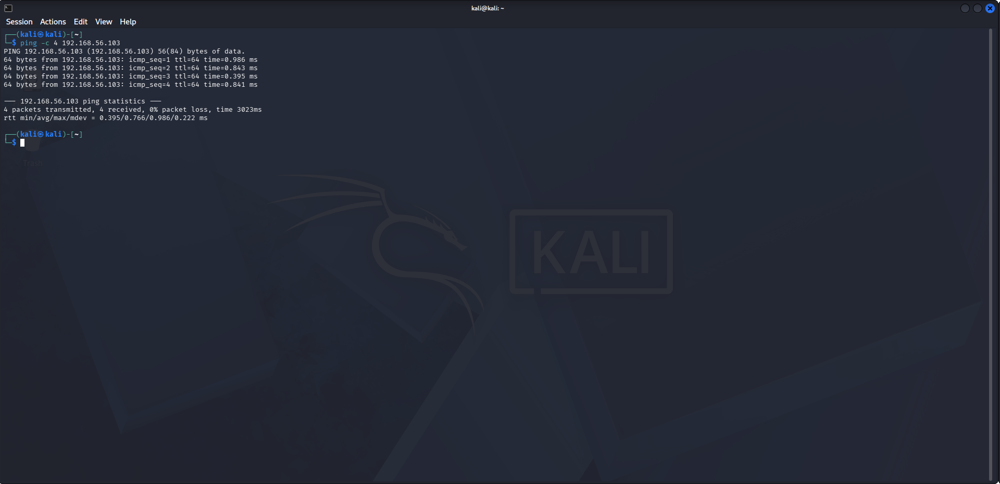
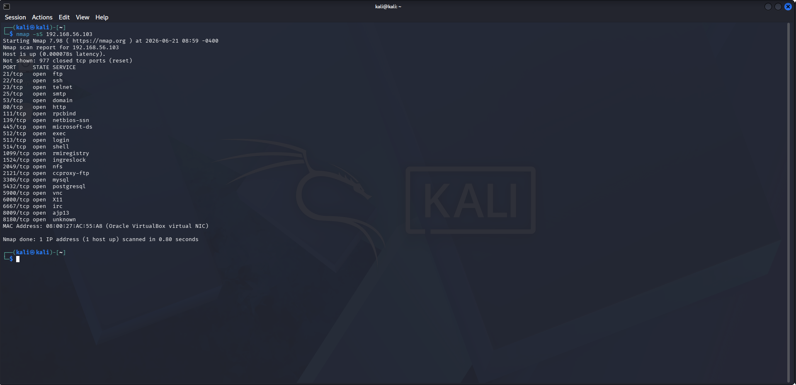
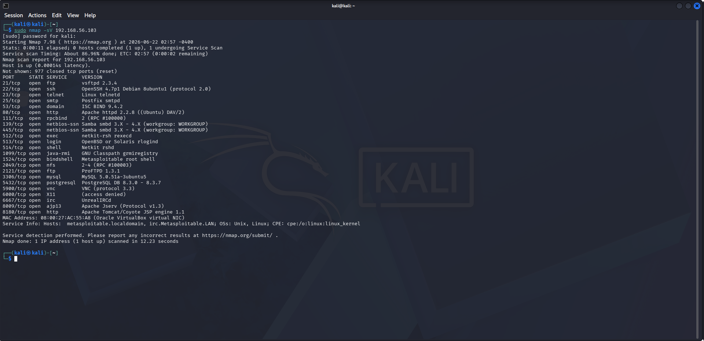
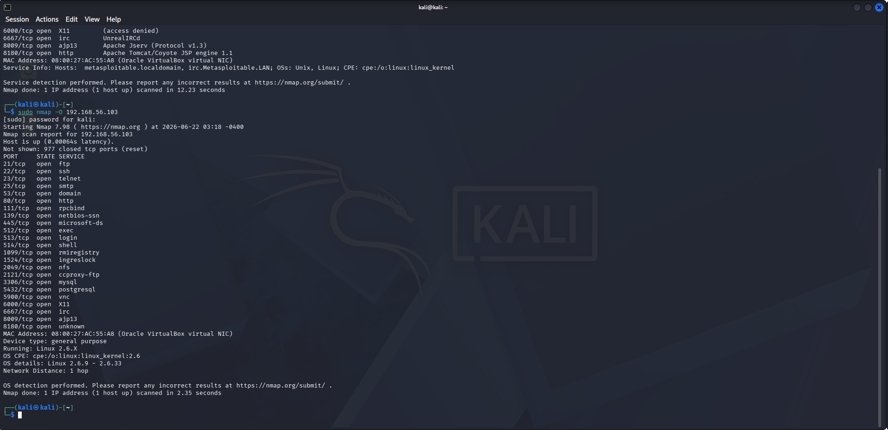
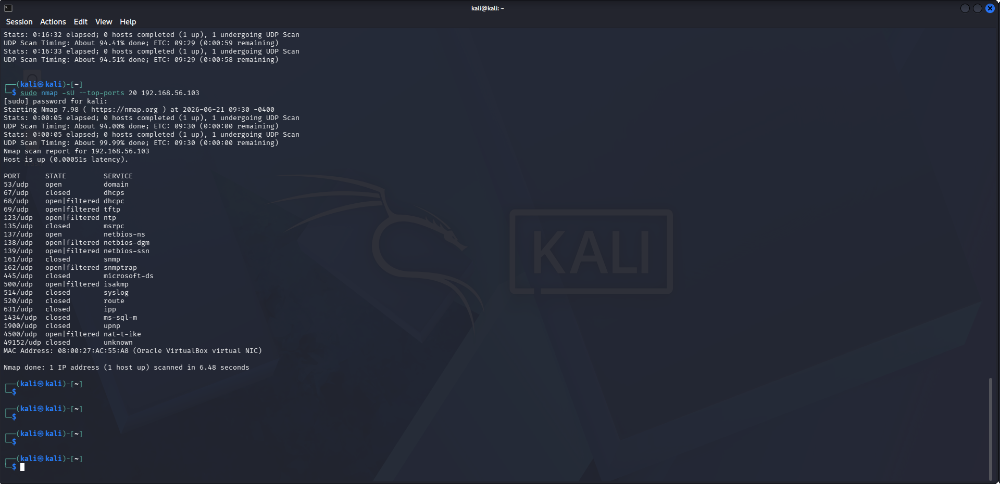
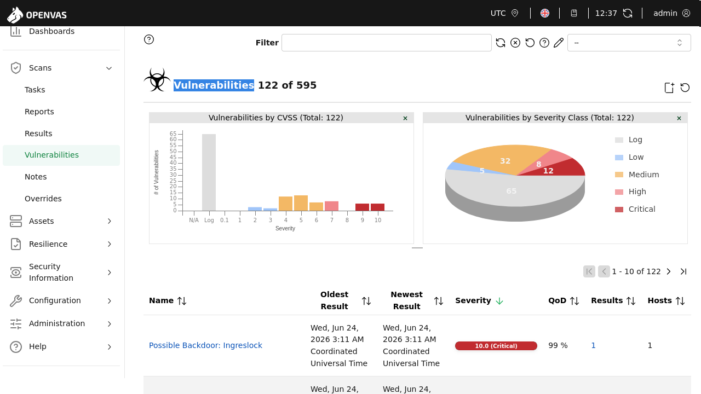
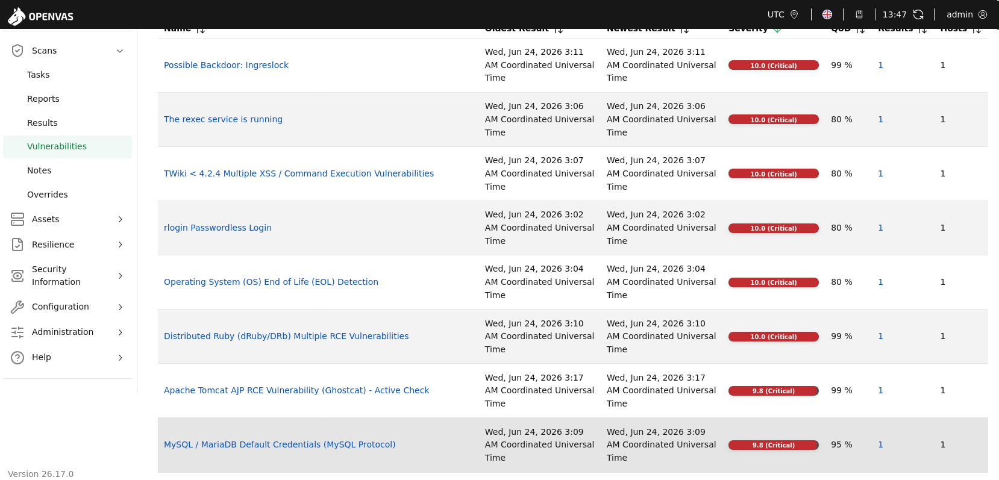

# Task 2 - Network Security & Scanning

## Objective
The objective of this task is to perform network reconnaissance, port scanning, vulnerability assessment, packet analysis, and firewall configuration using industry-standard cybersecurity tools.

## Tools Used
- Kali Linux
- Nmap
- OpenVAS
- Wireshark
- iptables
- Metasploitable2

## Target Information

| Target | IP Address |
|----------|----------|
| Metasploitable2 | 192.168.56.103 |

---

# 1. Reconnaissance

## Host Discovery

A ping test was performed to verify connectivity with the target host.

### Screenshot


### Result
The target host responded successfully, confirming it is active on the network.

---

# 2. Port & Service Scanning

## SYN Scan

Command:

```bash
nmap -sS 192.168.56.103
```

### Screenshot



### Findings

Several ports were identified as open including:

- FTP (21)
- SSH (22)
- Telnet (23)
- SMTP (25)
- HTTP (80)
- SMB (139, 445)
- MySQL (3306)
- PostgreSQL (5432)

---

## Service Version Detection

Command:

```bash
sudo nmap -sV 192.168.56.103
```

### Screenshot



### Findings

Detected service versions:

- vsftpd 2.3.4
- OpenSSH 4.7p1
- Apache HTTPD 2.2.8
- Samba 3.x
- MySQL 5.0.51a

---

## Operating System Detection

Command:

```bash
sudo nmap -O 192.168.56.103
```

### Screenshot



### Findings

Nmap identified the target as:

- Linux Kernel 2.6.x
- Unix/Linux based operating system

---

## UDP Scan

Command:

```bash
sudo nmap -sU --top-ports 20 192.168.56.103
```

### Screenshot



### Findings

Open UDP services detected:

- DNS (53)
- NetBIOS (137)

---

# 3. Vulnerability Assessment (OpenVAS)

An OpenVAS scan was performed against the Metasploitable2 target.

## OpenVAS Report Summary

### Screenshot


### Vulnerability Statistics

| Severity | Count |
|----------|--------|
| Critical | 13 |
| High | 9 |
| Medium | 40 |
| Low | 6 |

---

## Vulnerability Overview

### Screenshot



### Findings

OpenVAS identified a total of 122 vulnerabilities and security findings.

---

## Critical Vulnerabilities

### Screenshot



### Major Findings

- Possible Backdoor: Ingreslock
- rlogin Passwordless Login
- TWiki Multiple XSS Vulnerabilities
- Apache Tomcat Ghostcat Vulnerability
- MySQL Default Credentials
- Distributed Ruby Multiple RCE Vulnerabilities
- Operating System End of Life Detection
- vsftpd Backdoor Vulnerability

---

# 4. Packet Analysis with Wireshark

## HTTP Traffic Analysis

### Screenshot


### Observation

HTTP GET requests and server responses were captured successfully.

---

## FTP Traffic Analysis

### Screenshot


### Observation

FTP login communication was visible in plaintext, demonstrating the insecurity of unencrypted protocols.

---

## DNS Query Analysis

### Screenshot


### Observation

DNS queries and responses were captured and analyzed.

---

## SYN Flood Analysis

### Screenshot


### Observation

A large number of TCP SYN packets were detected, simulating a SYN flood attack scenario.

---

# 5. Firewall Basics

iptables rules were configured to allow and block specific ports.

## Configured Rules

- Allow SSH (Port 22)
- Block Telnet (Port 23)
- Block HTTP (Port 80)

### Screenshot


---

## Blocking Port Scan Attempt

An Nmap scan was performed from the Metasploitable2 machine against Kali Linux.

### Screenshot


### Result

The firewall successfully filtered:

- Port 23 (Telnet)
- Port 80 (HTTP)

while allowing:

- Port 22 (SSH)

---

# Conclusion

This task successfully demonstrated:

- Network reconnaissance
- Port scanning
- Service identification
- Operating system detection
- Vulnerability assessment using OpenVAS
- Packet analysis using Wireshark
- Firewall configuration using iptables

The vulnerability assessment revealed multiple critical security issues within the Metasploitable2 target, highlighting the importance of vulnerability management, secure configurations, and network monitoring.
